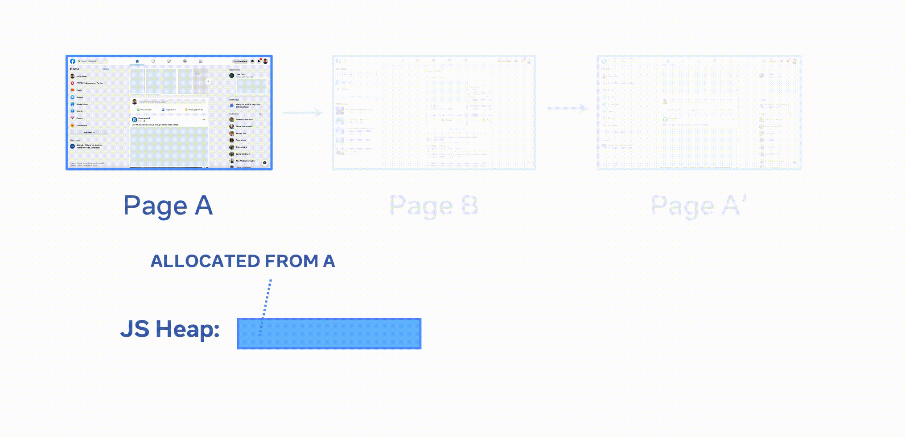

# How memlab Works

In a nutshell, memlab starts a headless Chrome browser, interacts with the page,
takes heap snapshots, and finds memory leaks by parsing, diffing, and analyzing
heap snapshots.

## 1. Browser Interaction
For example, if we want to find memory leaks triggered by some interactions
in a web app on a target page (`TP`), memlab visits the web page in the
following order:
 * Visit a different page - let's call it baseline page `BP` and take a
   heap snapshot named `SBP`
   *(the baseline page is specified by the **`url`**
   callback in [test scenario](api/interfaces/core_src.IScenario.md))*
 * Visit the target page `TP` or trigger the target interactions and take
   another heap snapshot `STP`
   *(navigating to the target page or triggering the target interactions are
   specified by the **`action`** callback in
   [test scenario](api/interfaces/core_src.IScenario.md))*
 * Finally, navigate to a different page or use any in-page interaction to
   trigger the releasing of memory that is supposed to be released from the
   target page. Here we reach the final state (`FP`), and take the final heap
   snapshot `SFP`.
   For example, in this step, you can close the widget opened by the target
   interactions, or return to the baseline page.
   *(the final navigation or interaction is specified by the **`back`**
   callback in [test scenario](api/interfaces/core_src.IScenario.md))*


With these heap snapshots, memlab finds memory leaks as explained
in the next section.

## 2. Heap Analysis

**Snapshot decoding**: memlab decodes V8 (or hermes) heap snapshots and
provides [APIs](./api/interfaces/core_src.IHeapSnapshot.md) that allows
querying JavaScript heap.

**Leak detection**: A superset of objects leaked from the target page can
be derived as follows:

```math
(STP \ SBP) ∩ SFP
```

MemLab first gets a set of allocated objects in `TP` (target interaction)
by excluding `SBP`'s objects (object allocated from the baseline page)
from `STP` (target heap snapshot).

Then it takes an intersection with objects in `FP` (object remaining on the
final page) to get objects that:

 1. are allocated from target interaction (`TP`)
 2. but remain alive when those objects are supposed to be released.

The built-in leak detectors use domain-specific heuristics to further refine
the list of leaked objects (e.g., detached DOM elements, error stack trace, etc.
memlab also identifies React Fiber tree and detects unmounted Fiber nodes).

## 3. Retainer Traces for Memory Leaks

memlab generates retainer traces from GC roots to leaked objects. Sometimes
certain interactions could trigger thousands of leaked objects, it would be
overwhelming to show all the retainer traces. memlab clusters all retainer
traces and only shows one retainer trace for each memory leak cluster.



In the animation, A represents the BP (baseline page), B represents the
TP (target page), and A' represents the FP (final page).
